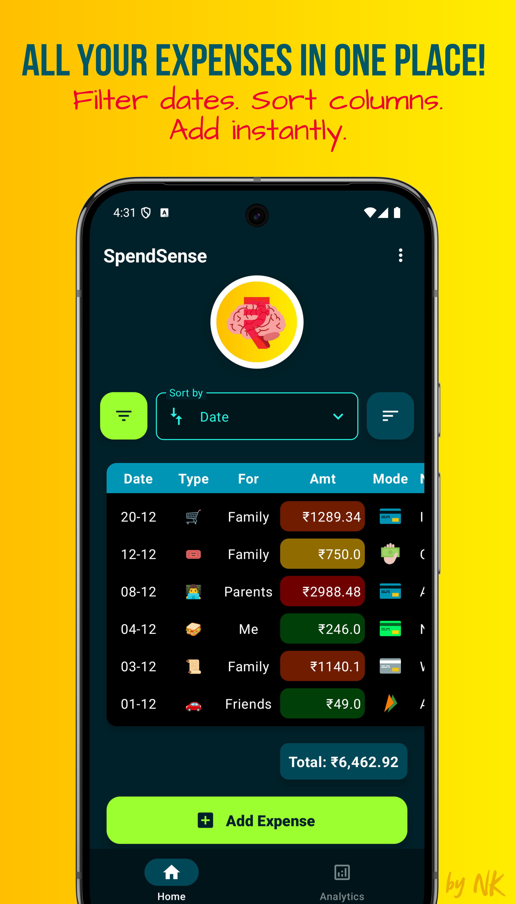
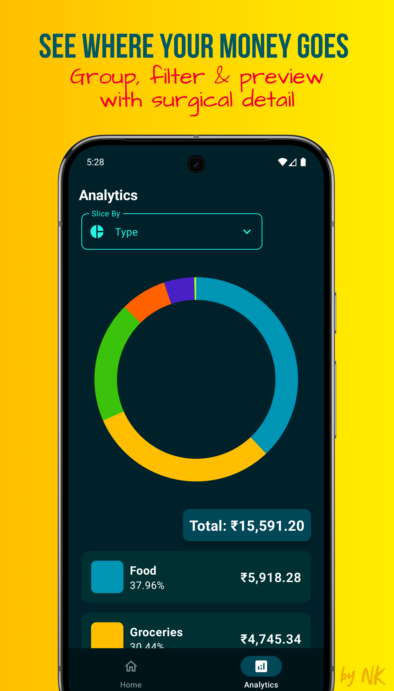

  

<h1 align="center">SpendSense</h1>

> [!NOTE]
> _Barely any LLMs were harmed in the making of this README :)_ 

SpendSense is a completely offline, 100% private, expense tracking app. It is designed and developed completely and individually by Naman Kashyap. _That's me. Hi! :)_

It's a powerful, completely local tool that gives you the power to add, maintain and analyse your spends

## Backstory
The inception of this app happened back in Feb 2024! I needed a spend tracking app, and since I'm privacy-oriented and a **developer**, I decided to build my own because I was not going to trust a 3rd party app with ALL of my spend related data.
> **"How hard could it be?"** - Me, Feb 2024

Since then, its been a grind. Every free weekend, every holiday from work. Basically any time I could find away from work and personal responsibilities (which were never in low supply).

I've had a working version of this app since May 2024 and I've been using it as my daily expense tracker since :) 

I hope this app becomes the go-to tool in your finance management arsenal for everyday use!
Dhanyavāda!

  
  

## Why SpendSense?
We all spend money every day, but rarely have a clear understanding of where, when, and on what it’s spent.

What we usually see is only a macro-level view of our total expenses.

If you want to save more, the first step is knowing exactly **where** and **on what** your money goes.

**SpendSense** is a simple, all-in-one solution to track expenses and get detailed, customisable insights into your spending.

## What SpendSense is NOT
- It is NOT an AI-infused application. Just plain old deterministic logic, written by a boring human. No LLMs.
- It does NOT have automated expense logging.
	- Why?
		1. That would require SMS-read permissions (not very private...)
		2. It would require NLP (Natural Language Processing) to understand which part of the message contains the expense amount. This requires heavy computation. Would require API calls to make the app light-weight, thus needing the internet (not very private...)
		3. It is quite impossible to ensure 100% accuracy and NO duplicate logging. Sometimes we do get two messages about the same transaction. Also, some transactions might not be intimated via SMS.
		4. So, overall it is quite complicated and would require some heavily over-engineered and YET incomplete solutions.

## The Trade-Off
- The price of complete *privacy* and a *guarantee* that your data is NEVER going to leave your device or be sold to advertisement agencies, is **convenience**.
- You do have to inculcate the habit/routine of always logging your expenses.
- The app can only give you benefits if you do your part.
> Tip: _"Logging an expense takes just 5 seconds, so I do it immediately after every spend. No backlog, no guilt."_

## Vote of Thanks!
- [SVG Repo](https://www.svgrepo.com): They have some wonderful, community driven, open-licensed SVGs! I've used them all over this app! :)
- [Pie Chart Reference](https://medium.com/@developerchunk/create-custom-pie-chart-with-animations-in-jetpack-compose-android-studio-kotlin-49cf95ef321e): This is the approach I used because I couldn't find any nice libraries for pie/doughnut charts... It's quite a nice approach! I loved it.
- [YouTube intro to Room Databases](https://www.youtube.com/watch?v=bOd3wO0uFr8): This got me started!
- [Android Dev Documentation](https://developer.android.com/): Some of the best documentation I've seen!
- [Material3](https://m3.material.io/): Goes without saying :)
